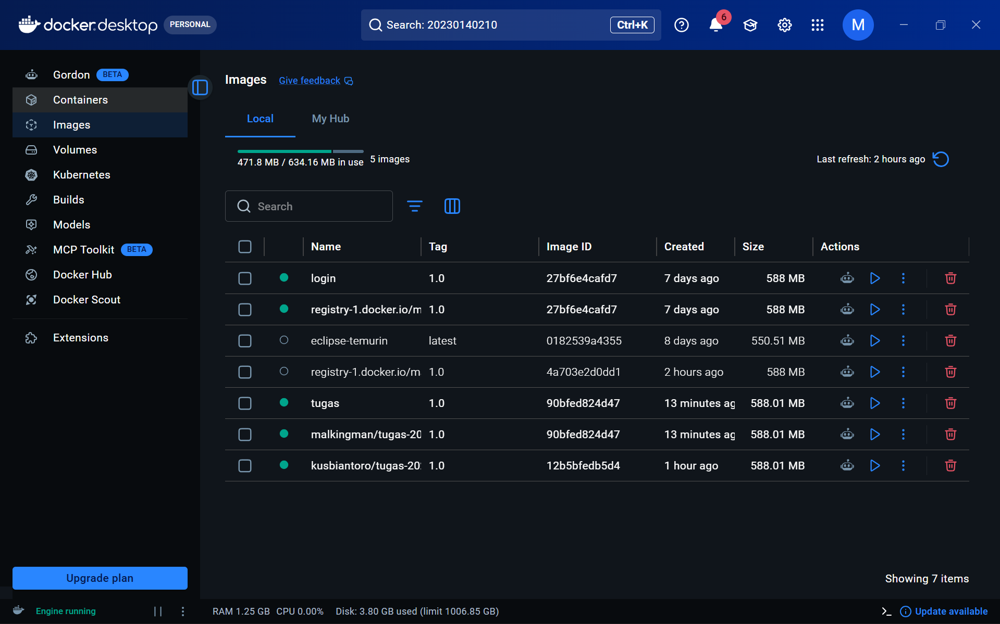
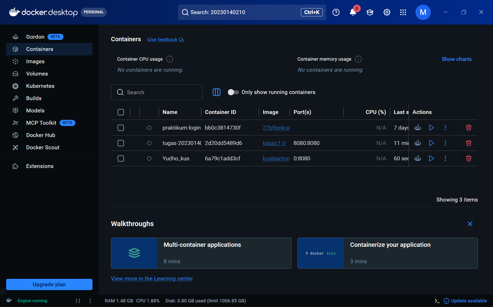
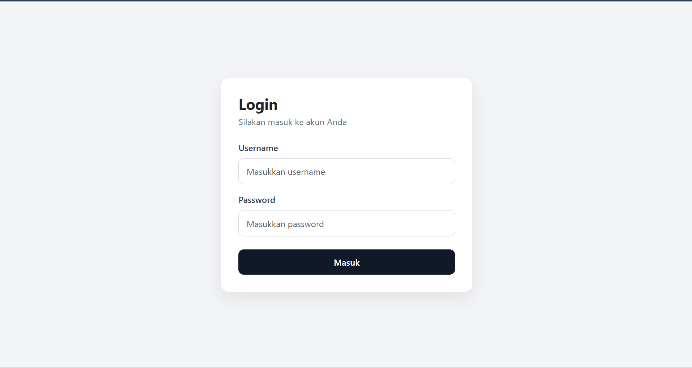
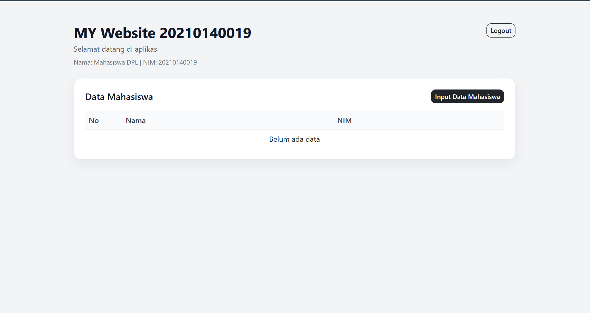
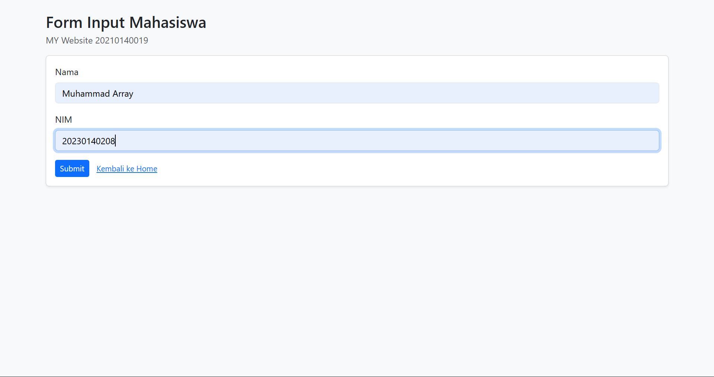

#  Praktikum 6 — Docker Deployment: Spring Boot Login + Input Mahasiswa

> **Mata Kuliah:** Deployment Perangkat Lunak  
> **Nama:** Muhammad Array Al-khozini  
> **NIM:** 20230140208  
> **Pertemuan:** 6 — Containerization dengan Docker

---

##  Deskripsi Aplikasi

Aplikasi web sederhana menggunakan **Spring Boot + Thymeleaf** yang telah di-*containerize* menggunakan **Docker**. Fitur utama:

-  Login manual (`/login`) tanpa Spring Security
-  Home (`/home`) menampilkan data mahasiswa dari memori
-  Form (`/form`) untuk input data mahasiswa
-  Penyimpanan sementara menggunakan `List<User>` (tanpa database)

---

##  Akun Login

| Field    | Value           |
|----------|-----------------|
| Username | `array`         |
| Password | `20230140208`   |

---

### Via Docker

```bash
# Build image
docker build -t spring-login-app .

# Run container
docker run -p 8080:8080 spring-login-app
```

##  Screenshots

### 1. Docker Desktop — Halaman Images

> Tampilan Docker Desktop setelah **push image project sendiri** dan **pull image dari teman**.

<div align="center">



</div>

---

### 2. Docker Desktop — Halaman Containers

> Tampilan container yang sudah dibuat dari **image milik teman** yang di-*pull* dari Docker Hub.

<div align="center">



</div>

---

### 3. Halaman Web Sendiri (Dijalankan via Docker)

> Keempat halaman berikut dijalankan dari **container Docker milik sendiri**.

<table>
  <tr>
    <th align="center"> Halaman Login</th>
    <th align="center"> Halaman Home</th>
  </tr>
  <tr>
    <td align="center">
      
    </td>
    <td align="center">
      
    </td>
  </tr>
  <tr>
    <th align="center"> Halaman Form Input</th>
    <th align="center"> Home Setelah Input Data</th>
  </tr>
  <tr>
    <td align="center">
      
    </td>
    <td align="center">
      
    </td>
  </tr>
</table>

---

### 4. Halaman Web Teman (Dijalankan via Docker — Image Pull)

> Keempat halaman berikut dijalankan dari **container Docker image milik teman** yang di-*pull* dari Docker Hub.

<table>
  <tr>
    <th align="center"> Halaman Login Teman</th>
    <th align="center"> Halaman Home Teman</th>
  </tr>
  <tr>
    <td align="center">
      
    </td>
    <td align="center">
      
    </td>
  </tr>
  <tr>
    <th align="center"> Halaman Form Teman</th>
    <th align="center"> Home Teman Setelah Input</th>
  </tr>
  <tr>
    <td align="center">
      
    </td>
    <td align="center">
      
    </td>
  </tr>
</table>

---

## 📝 Catatan

- Data mahasiswa akan **hilang** saat aplikasi/container dihentikan atau di-*restart* (in-memory storage).
- Pastikan port `8080` tidak digunakan oleh proses lain sebelum menjalankan container.
- Image dapat di-*push* ke Docker Hub menggunakan: `docker push <username>/<image-name>`

---

<div align="center">
  <sub>© 2026 · Muhammad Array Al-khozini · NIM 20230140208 · Universitas Muhammadiyah Yogyakarta</sub>
</div>
